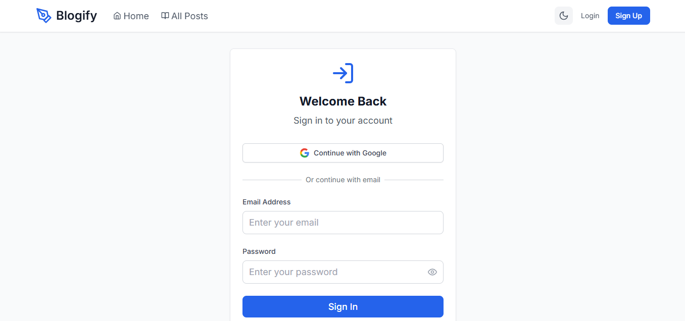
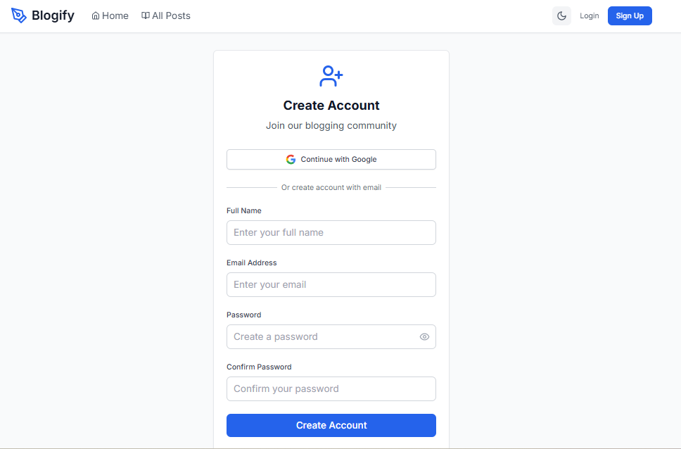
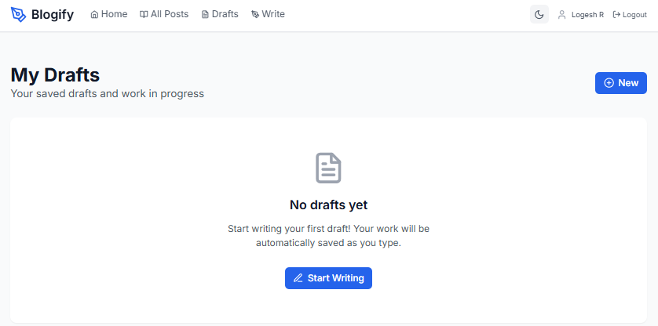
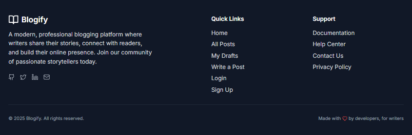

# Blogify - Full-Stack Blogging Platform

A modern, full-featured blogging platform built with Next.js, Express.js, and Supabase. Blogify provides a seamless writing experience with powerful features for content creators and readers alike.

## Secreenshots

### Login Page


### Signup Page


### Home Page


### Post Page


### Create Post Page


### Draft Page


### Footer



## Features

### Core Features
- **User Authentication**: JWT-based authentication with Google OAuth integration
- **Post Management**: Create, edit, delete, and publish blog posts
- **Draft System**: Save drafts and publish when ready
- **Rich Text Editor**: Intuitive content creation experience
- **Responsive Design**: Mobile-first design with dark mode support
- **Auto-save**: Automatic draft saving while writing
- **SEO Optimized**: Built-in SEO optimization for better discoverability

### User Experience
- **Community Driven**: Connect with fellow writers
- **Analytics Insights**: Track post performance and engagement
- **Lightning Fast**: Optimized for speed and performance
- **Secure & Private**: Enterprise-grade security
- **Global Reach**: Share stories worldwide

## 🛠 Tech Stack

### Frontend
- **Next.js** - React framework with App Router

### Backend
- **Express.js** - Node.js web framework
- **Supabase** - Database and authentication
- **JWT** - JSON Web Tokens for authentication
- **bcryptjs** - Password hashing
- **Helmet** - Security middleware
- **CORS** - Cross-origin resource sharing

### Development Tools
- **Jest** - Testing framework
- **ESLint** - Code linting
- **Nodemon** - Development server
- **Concurrently** - Run multiple commands

## Project Structure

```
blogify/
├── src/                          # Frontend source code
│   ├── app/                      # Next.js App Router pages
│   │   ├── posts/               # Post-related pages
│   │   ├── layout.js            # Root layout
│   │   └── page.js              # Home page
│   ├── components/              # Reusable React components
│   ├── contexts/                # React contexts (Auth, etc.)
│   ├── hooks/                   # Custom React hooks
│   ├── lib/                     # Utility libraries
│   └── styles/                  # Global styles
├── backend/                     # Backend API server
│   ├── routes/                  # API route handlers
│   │   ├── auth.js             # Authentication routes
│   │   ├── posts.js            # Post management routes
│   │   ├── drafts.js           # Draft management routes
│   │   └── users.js            # User management routes
│   ├── services/               # Business logic services
│   ├── middleware/             # Express middleware
│   ├── lib/                    # Backend utilities
│   └── server.js               # Express server entry point
├── public/                     # Static assets
├── scripts/                    # Setup and utility scripts
└── package.json               # Project dependencies
```

## API Reference

### Base URL
```
http://localhost:5000/api
```

### Authentication
All protected endpoints require a JWT token in the Authorization header:
```
Authorization: Bearer <jwt-token>
```

---

### Authentication Endpoints

#### Register User
```http
POST /api/auth/register
```

**Request Body:**
```json
{
  "name": "logesh",
  "email": "logesh@sen.com",
  "password": "password123"
}
```

**Response:**
```json
{
  "message": "User registered successfully",
  "user": {
    "id": "1",
    "name": "logesh",
    "email": "logesh@sen.com",
    "createdAt": "2024-01-01T00:00:00.000Z"
  },
  "token": "eyJhbGciOiJIUzI1NiIsInR5cCI6IkpXVCJ9..."
}
```

#### Login User
```http
POST /api/auth/login
```

**Request Body:**
```json
{
  "email": "logesh@sen.com",
  "password": "password123"
}
```

**Response:**
```json
{
  "message": "Login successful",
  "user": {
    "id": "1",
    "name": "logesh",
    "email": "logesh@sen.com"
  },
  "token": "eyJhbGciOiJIUzI1NiIsInR5cCI6IkpXVCJ9..."
}
```

#### OAuth Login
```http
POST /api/auth/oauth
```

**Request Body:**
```json
{
  "name": "logesh",
  "email": "logesh@sen.com"
}
```

#### Get Current User
```http
GET /api/auth/me
```
*Requires authentication*

**Response:**
```json
{
  "user": {
    "id": "1",
    "name": "logesh",
    "email": "logesh@sen.com",
    "createdAt": "2024-01-01T00:00:00.000Z"
  }
}
```

---

**Response:**
```json
{
  "posts": [
    {
      "id": "1",
      "title": "My First Blog Post",
      "content": "This is the content of my first blog post...",
      "excerpt": "This is the content of my first blog post...",
      "author": "logesh",
      "authorId": "1",
      "createdAt": "2024-01-01T00:00:00.000Z",
      "updatedAt": "2024-01-01T00:00:00.000Z",
      "published": true,
      "tags": []
    }
  ],
  "total": 1,
  "limit": 10,
  "offset": 0
}
```

#### Get Single Post
```http
GET /api/posts/:id
```

**Response:**
```json
{
  "id": "1",
  "title": "My First Blog Post",
  "content": "This is the content of my first blog post...",
  "excerpt": "This is the content of my first blog post...",
  "author": "logesh",
  "authorId": "1",
  "createdAt": "2024-01-01T00:00:00.000Z",
  "updatedAt": "2024-01-01T00:00:00.000Z",
  "published": true,
  "tags": []
}
```

#### Create Post
```http
POST /api/posts
```
*Requires authentication*

**Request Body:**
```json
{
  "title": "My New Blog Post",
  "content": "This is the content of my new blog post...",
  "published": true,
  "tags": ["technology", "web-development"]
}
```

**Response:**
```json
{
  "message": "Post created successfully",
  "post": {
    "id": "2",
    "title": "My New Blog Post",
    "content": "This is the content of my new blog post...",
    "excerpt": "This is the content of my new blog post...",
    "author": "logesh",
    "authorId": "1",
    "createdAt": "2024-01-01T00:00:00.000Z",
    "updatedAt": "2024-01-01T00:00:00.000Z",
    "published": true,
    "tags": []
  }
}
```

#### Update Post
```http
PUT /api/posts/:id
```
*Requires authentication and ownership*

**Request Body:**
```json
{
  "title": "Updated Blog Post Title",
  "content": "Updated content...",
  "published": true,
  "tags": ["updated", "technology"]
}
```

#### Delete Post
```http
DELETE /api/posts/:id
```
*Requires authentication and ownership*

**Response:**
```json
{
  "message": "Post deleted successfully",
  "post": {
    "id": "1",
    "title": "My First Blog Post"
  }
}
```

---

### Drafts Endpoints

#### Get User Drafts
```http
GET /api/drafts?limit=10&offset=0
```
*Requires authentication*

**Response:**
```json
{
  "drafts": [
    {
      "id": "1",
      "title": "Draft Post",
      "content": "This is a draft...",
      "author": "logesh",
      "authorId": "1",
      "createdAt": "2024-01-01T00:00:00.000Z",
      "updatedAt": "2024-01-01T00:00:00.000Z"
    }
  ],
  "total": 1,
  "limit": 10,
  "offset": 0
}
```

#### Create Draft
```http
POST /api/drafts
```
*Requires authentication*

**Request Body:**
```json
{
  "title": "My Draft",
  "content": "This is a draft post..."
}
```

#### Update Draft
```http
PUT /api/drafts/:id
```
*Requires authentication and ownership*

#### Delete Draft
```http
DELETE /api/drafts/:id
```
*Requires authentication and ownership*

#### Publish Draft
```http
POST /api/drafts/:id/publish
```
*Requires authentication and ownership*

**Request Body:**
```json
{
  "published": true,
  "tags": ["published", "from-draft"]
}
```

---

### Users Endpoints

#### Get All Users
```http
GET /api/users?limit=10&offset=0
```

#### Get User Profile
```http
GET /api/users/:id
```

#### Update User
```http
PUT /api/users/:id
```
*Requires authentication*

**Request Body:**
```json
{
  "name": "loki",
  "email": "loki@sen.com"
}
```

#### Get User Statistics
```http
GET /api/users/:id/stats
```

**Response:**
```json
{
  "user": {
    "id": "1",
    "name": "logesh",
    "email": "logesh@sen.com"
  },
  "stats": {
    "totalPosts": 5,
    "publishedPosts": 4,
    "draftPosts": 1,
    "totalViews": 150,
    "joinedDate": "2024-01-01T00:00:00.000Z",
    "lastActive": "2024-01-15T00:00:00.000Z"
  }
}
```
